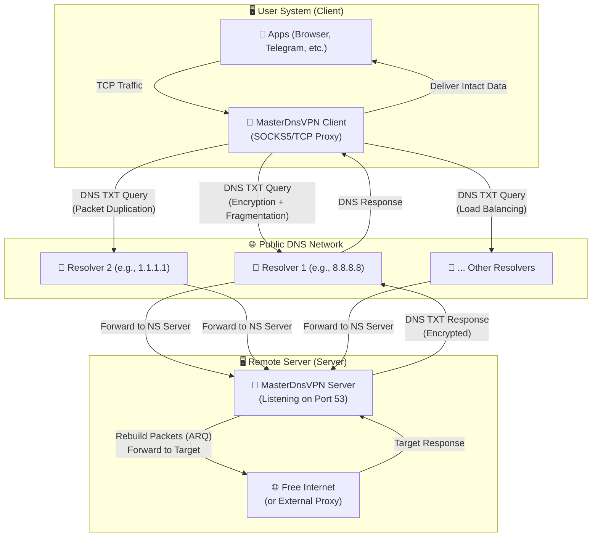
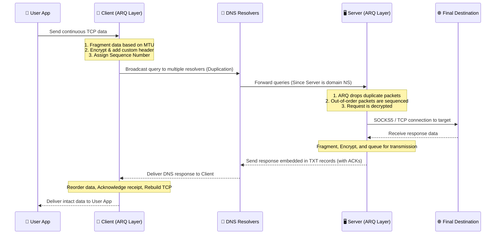

# MasterDnsVPN Project 🚀

## [نسخه فارسی](https://github.com/masterking32/MasterDnsVPN/blob/main/README_FA.MD) | [English Version](https://github.com/masterking32/MasterDnsVPN/blob/main/README.MD) | [Spanish Version](https://github.com/masterking32/MasterDnsVPN/blob/main/README_ES.MD)

The **MasterDnsVPN** project is a robust, low-overhead, and advanced solution for bypassing internet censorship and filtering by hiding and encapsulating TCP traffic within DNS queries.

This system is specifically designed to bypass strict firewalls and severe network restrictions where traditional VPN protocols, or even well-known DNS tunneling services like **DNSTT** and **SlipStream**, are blocked or rendered useless due to massive disruptions and DNS resolver limitations.

The primary goal of **MasterDnsVPN** is to provide a secure, reliable, and flexible tunnel that minimizes protocol overhead and delivers stable, acceptable performance even in networks suffering from high Packet Loss or strict MTU limitations.

---

# Announcement Channel 📢

### For the latest news, updates, and changes regarding this project, please follow our Telegram channel: [Telegram Channel](https://t.me/masterdnsvpn)

---

⭐ If you use or like this project, please consider supporting us by giving the repository a Star! ⭐

---

## Key Features & Advantages ✨

- 🛡️ **Bypassing Strict Censorship:**  Specifically designed to increase the probability of penetrating firewalls and restrictive network policies that block standard VPN protocols.

- ⚡ **Load Balancing & Resolver Diversity:** Supports multiple DNS Resolvers with advanced packet load-balancing strategies (including Random, Round-Robin, and Least Loss).

- 📡 **Packet Duplication (Multipath):** Capable of sending the same packet simultaneously through multiple routes (different resolvers and domains). Whichever packet arrives first is processed; if a packet drops on one route, its duplicate arrives safely via another. This technique increases bandwidth usage but drastically improves reliability and stability in highly disrupted networks (adjustable and can be disabled).

- 🔄 **Custom ARQ Protocol & Overhead Optimization:**  Implements a custom ARQ (Automatic Repeat reQuest) layer over UDP/DNS for packet retransmission and sequencing instead of relying on QUIC. This eliminates the heavy overhead of QUIC, reduces the required MTU, and ensures compatibility with resolvers that lack EDNS support or have low MTU limits. Packet structures are minimized to reduce application-side overhead.

- 🔐 **Strong Security & Flexible Encryption:** Supports various robust encryption methods to ensure user privacy, including: `XOR`, `ChaCha20`, `AES-128-GCM`, `AES-192-GCM`, and `AES-256-GCM`.

- 🧰 **Auto-Scanning & MTU Probing:** Upon execution, the client automatically scans all configured resolvers, tests their quality, displays the results, and calculates the optimal MTU for your network paths.

- 🌐 **TCP Multiplexing:** Multiplexes multiple local TCP connections onto a single DNS session for optimal resource management.

- 🗜️ **Small Packet Compression/Packing:** If configured, the system can merge multiple small packets into a single payload up to the MTU limit. This drastically reduces the number of outbound DNS requests and frees up space for actual payload data.

- 🧦 **Dedicated SOCKS5 Optimization:** In recent versions, specific optimizations have been applied for SOCKS5. The system automatically handles SOCKS5 forwarding, eliminating the need to install third-party proxy tools like X-UI or Dante. Furthermore, setting the protocol to SOCKS5 strips away redundant SOCKS handshake packets over the tunnel, significantly reducing traffic.

- 🚀 **Forwarding Various TCP Protocols:** Besides the highly optimized SOCKS5 integration, you can also forward other TCP-based services like `VLESS`, `ShadowSocks`, `VMESS`, etc.


# Setup Guide 🧑‍💻

## Section 1: Network Prerequisites (DNS Config) 🛠️

For your server to directly receive and process DNS queries, you must delegate a subdomain to your dedicated server. Log in to your domain's DNS management panel (e.g., Cloudflare, ArvanCloud) and create the following two records:

### Step 1.1: Create an A Record (Server IP) 🅰️
First, create an `A` record pointing a subdomain to your server's Public IPv4 address.
- **Type:** `A`
- **Name:** A short, arbitrary name (e.g., `ns`)
- **IPv4 address:** Your server's IP address (e.g., `1.2.3.4`)
  > **Result:** `ns.example.com -> 1.2.3.4`

### Step 1.2: Create an NS Record (Tunnel Subdomain) 🏷️
Next, create an `NS` (Name Server) record. This tells the internet that the server you defined in the previous step is responsible for handling queries for this specific subdomain.
- **Type:** `NS`
- **Name:** The main tunnel subdomain (e.g., `v`)
- **Target/Nameserver:** The A record you created in Step 1.1 (e.g., `ns.example.com`)
  > **Result:** `v.example.com -> ns.example.com`

---

## Section 1.3: Crucial Warning (Cloudflare Users) ⚠️
If you are using Cloudflare, the Proxy status for the `A` record **MUST** be set to **DNS only (Gray Cloud ☁️)**. If the proxy is enabled (Orange Cloud), Cloudflare will block UDP port 53 traffic, and your tunnel **will not work at all**!

## Section 1.4: Golden Tip for Speed (MTU) 💡
In the DNS protocol, the length of your domain name consumes part of the very limited payload capacity of each packet. Using **shorter** domain and subdomain names (e.g., `v.ex.com` instead of `tunnel.my-long-domain.com`) leaves more free space for the actual user payload. This directly results in higher bandwidth, faster speeds, and fewer connection drops.

---

## Section 2: Installation & Execution (Client & Server) 🚀

You can install and run this project using two methods: the fast, pre-compiled automated method (Recommended), or directly from the Python source code.

### Step 2.1: Quick Linux Server Setup 🐧

If you want to set up the server on a Linux machine, the easiest way is using the automated installation script. Simply run the following command in your server's terminal:

```bash
bash <(curl -Ls https://raw.githubusercontent.com/masterking32/MasterDnsVPN/main/server_linux_install.sh)
```

This command downloads a script from GitHub and automatically handles the entire installation and configuration process. Once finished, the server will start, and an **Encryption Key** will be displayed in the terminal logs. Make sure to copy this key (it is also saved in `encrypt_key.txt` next to the server executable for convenience), as you will need it to connect the client.

> ⚠️ **Important Note 1:** Before running this script, you must own a domain and have properly configured your DNS records (Section 1).
> 
> ⚠️ **Important Note 2:** This script only sets up the Linux server and does not include the client. To run the client on your local machine, use "Step 2.2" below.
> 
> ⚠️ **Important Note 3:** You can also use this command to update your server. When a new version is released, running this script again will automatically update your server.

---

### Step 2.2: Using Pre-compiled Client Binaries (Recommended ✅)

For your convenience, the client executables (and servers for other OSs) are pre-compiled. Simply download the correct version for your operating system and extract the ZIP file.

> 💡 **Note:** Every Client ZIP file contains the client executable and a default configuration template named `client_config.toml`. 

#### MasterDnsVPN Client Download Links 📥

| Operating System (OS) | Architecture | Suitable For... | Direct Download Link |
| :--- | :--- | :--- | :--- |
| Windows 🪟 | `AMD64` (64-bit) | Windows 10 & 11 | [Download Windows Version ⬇️](https://github.com/masterking32/MasterDnsVPN/releases/latest/download/MasterDnsVPN_Client_Windows_AMD64.zip) |
| macOS 🍎 | `ARM64` | Newer Macs (M1 / M2 / M3) | [Download Mac (Apple Silicon) ⬇️](https://github.com/masterking32/MasterDnsVPN/releases/latest/download/MasterDnsVPN_Client_MacOS_ARM64.zip) |
| Linux 🐧 | `AMD64` (64-bit) | Newer distros (Ubuntu 22.04+, Debian 12+) | [Download Linux (New) ⬇️](https://github.com/masterking32/MasterDnsVPN/releases/latest/download/MasterDnsVPN_Client_Linux_AMD64.zip) |
| Linux (Legacy) 🐧 | `AMD64` (64-bit) | Older distros (Ubuntu 20.04, Debian 11) | [Download Linux (Legacy) ⬇️](https://github.com/masterking32/MasterDnsVPN/releases/latest/download/MasterDnsVPN_Client_Linux-Legacy_AMD64.zip) |
| Linux (ARM) 🐧 | `ARM64` | ARM servers, Raspberry Pi, etc. | [Download Linux (ARM) ⬇️](https://github.com/masterking32/MasterDnsVPN/releases/latest/download/MasterDnsVPN_Client_Linux_ARM64.zip) |

*(Windows and Mac users can extract the file and immediately proceed to Section 3 for configuration).*

#### MasterDnsVPN Server Download Links 📤
*(Only if you did not use the quick install script)*

| Operating System (OS) | Architecture | Suitable For... | Direct Download Link |
| :--- | :--- | :--- | :--- |
| Windows 🪟 | `AMD64` (64-bit) | Windows Server, Windows 10 & 11 | [Download Windows Server ⬇️](https://github.com/masterking32/MasterDnsVPN/releases/latest/download/MasterDnsVPN_Server_Windows_AMD64.zip) |
| Linux 🐧 | `AMD64` (64-bit) | Ubuntu 22.04+, Debian 12+ servers | [Download Linux Server (New) ⬇️](https://github.com/masterking32/MasterDnsVPN/releases/latest/download/MasterDnsVPN_Server_Linux_AMD64.zip) |
| Linux (Legacy) 🐧 | `AMD64` (64-bit) | Older servers (Ubuntu 20.04, Debian 11) | [Download Linux Server (Legacy) ⬇️](https://github.com/masterking32/MasterDnsVPN/releases/latest/download/MasterDnsVPN_Server_Linux-Legacy_AMD64.zip) |
| Linux (ARM) 🐧 | `ARM64` | ARM cloud servers | [Download Linux Server (ARM) ⬇️](https://github.com/masterking32/MasterDnsVPN/releases/latest/download/MasterDnsVPN_Server_Linux_ARM64.zip) |
| macOS 🍎 | `ARM64` | Newer Macs (M1 / M2 / M3) | [Download Mac Server (Apple Silicon) ⬇️](https://github.com/masterking32/MasterDnsVPN/releases/latest/download/MasterDnsVPN_Server_MacOS_ARM64.zip) |

---

### Step 2.2.1: Extraction & Prep on Linux 🗂️

On Linux, after downloading the ZIP file, ensure you have the required extraction and text editing tools:

```bash
sudo apt update
sudo apt install unzip nano
```

Extract the downloaded ZIP (change the filename based on the version you downloaded):

```bash
# Extract the client (or server)
unzip MasterDnsVPN_Client_Linux_AMD64.zip

# List extracted files
ls
```

On Linux and macOS, you must grant execute permissions to the binary file. Enter the exact filename as outputted by the `ls` command:

```bash
chmod +x MasterDnsVPN_Client_Linux_AMD64
```

Now, open the configuration file (`client_config.toml` or `server_config.toml`) with the `nano` editor and fill in your details (refer to Section 3 for configuration variables):

```bash
nano client_config.toml
```

> **Note:** In `nano`, press `Ctrl + O` then `Enter` to save, and `Ctrl + X` to exit.

After saving the configuration, run the program:

```bash
./MasterDnsVPN_Client_Linux_AMD64
```

---

### Step 2.3: Python Source Code Setup (For Developers 🧑‍💻)

> ⚠️ **Notice:** If you are a standard user, you do not need this section. Please use Step 2.2 and proceed directly to "Section 3: Configuration". This method is strictly for developers who wish to modify or execute the raw Python code.

To run the source code, Python must be installed. Run the following commands in your terminal:

```bash
# Clone the repository and install dependencies
git clone https://github.com/masterking32/MasterDnsVPN.git
cd MasterDnsVPN
pip install -r requirements.txt

# Copy configuration templates
cp server_config.toml.simple server_config.toml
cp client_config.toml.simple client_config.toml

# Edit configurations, then run server or client
python server.py
python client.py
```

---

# Section 3: Configuration Structure (Config) 🛠️

## Section 3.1: Quick Client Setup & Run 🚀

If you launched your server using the Quick Install script (Step 2.1), you only need to edit `client_config.toml` on your client machine. The three main parameters you MUST configure are:

1. **`ENCRYPTION_KEY`**: Paste the encryption key displayed in your server terminal (or found in `encrypt_key.txt` on the server). The connection will be rejected without this key!
2. **`DOMAINS`**: Enter your tunnel subdomain exactly (e.g., `["v.example.com"]`). **Note:** Currently, only provide ONE domain. Multi-domain support will be finalized in future updates.
3. **`RESOLVER_DNS_SERVERS`**: A list of public DNS resolvers to route the tunnel traffic through (e.g., `["8.8.8.8", "1.1.1.1"]`).

> ⚠️ **Important Note 1 (Encryption):** The quick install script defaults the server encryption to `XOR`. Ensure that `DATA_ENCRYPTION_METHOD` in your client config is also set to `1` to match the server.
> 
> ⚠️ **Important Note 2 (Connection):** The default protocol is `SOCKS5`. Once the client is running, you must configure your applications (Browser, Telegram, etc.) to use a SOCKS5 proxy pointing to `127.0.0.1` and the configured port (Default: `1080`). By default, this local proxy requires authentication with the username/password: `master_dns_vpn` (this can be changed in the config).
> 
> ⚠️ **Support:** If you encounter issues, please attach your error logs and exclusively open an issue on our [GitHub Issues](https://github.com/masterking32/MasterDnsVPN/issues) page.

---

## Section 3.2: Server Configuration (Manual Install) ⚙️

If you **did not** use the script in Step 2.1 and want to configure the server manually, edit the `server_config.toml` file. Ensure that critical parameters like the encryption method and domain match **exactly** on both the server and client.

---

## Section 3.3: Client Configuration Variables (`client_config.toml`) 📖

The table below explains all available settings and their functions in the client:

| Parameter | Default Value | Accepted Values | Description |
|---------|--------------|------------------|-------|
| `PROTOCOL_TYPE` | `"SOCKS5"` | `"SOCKS5"`, `"TCP"` | **Tunnel Protocol Type:**<br><br>• `"SOCKS5"`:<br> Highly recommended. SOCKS code in this project is heavily optimized for maximum speed.<br>• `"TCP"`:<br> Used to forward raw ports/protocols like VLESS or OpenVPN (has higher overhead). <br>**Note**: Must match the server setting. |
| `DOMAINS` | `["v.domain.com"]` | Array list (e.g., `["sub.site.com"]`) | The <br>NS<br> subdomain configured in Section 1. This must be exactly the same on both Client and Server. <br> Currently, avoid adding multiple domains! |
| `DATA_ENCRYPTION_METHOD` | `1` | `0` to `5` | **Encryption Algorithm:**<br><br>`0`: Disabled (No security)<br>`1`: XOR algorithm (Recommended - High speed, Medium security)<br>`2`: ChaCha20<br>`3`: AES-128-GCM<br>`4`: AES-192-GCM<br>`5`: AES-256-GCM (Highest security, lowest speed) |
| `ENCRYPTION_KEY` | `""` | String | Encryption key matched with the server. Connections fail without this. |
| `LISTEN_IP` | `"0.0.0.0"` | Valid IP (e.g., `127.0.0.1`) | Local IP address the client listens on.<br><br>• `"127.0.0.1"`: Local device only (more secure)<br>• `"0.0.0.0"`: Accessible by all devices on your local network |
| `LISTEN_PORT` | `1080` | Port number (e.g., `1080`) | The port the client listens on so your apps (Browser, Telegram) can connect. |
| `SOCKS5_AUTH` | `true` | `true` or `false` | Enables local <br>SOCKS5<br> authentication. (If `false`, connecting to your proxy requires no user/pass). **Note:** This setting is solely for your local machine's security and has nothing to do with the tunnel connection. It only works if the protocol is set to <br>SOCKS5<br>. |
| `SOCKS5_USER` | `"master_dns_vpn"` | Custom String | Username for the local SOCKS proxy (if `SOCKS5_AUTH` is active). |
| `SOCKS5_PASS` | `"master_dns_vpn"` | Custom String | Password for the local SOCKS proxy (if `SOCKS5_AUTH` is active). |
| `RESOLVER_DNS_SERVERS` | `["8.8.8.8", "1.1.1.1"]` | List of IPs | List of public DNS servers (like Google, Cloudflare) the tunnel sends traffic through. Add more IPs for increased stability. |
| `PACKET_DUPLICATION_COUNT` | `3` | Positive integer (`1` for off, `2`, `3`+) | Number of times a packet is duplicated. E.g., `3` means every packet is sent simultaneously to 3 different resolvers. First response is accepted. Consumes bandwidth but minimizes drops on highly disrupted networks. |
| `RESOLVER_BALANCING_STRATEGY` | `1` | `1`, `2`, `3` | **Load Balancing Strategy:**<br><br>`1`: **Random**: Randomly selects a server.<br>`2`: **Round-Robin**: Rotates sequentially through the list.<br>`3`: **Least Loss**: Intelligently selects the server with the lowest packet loss. |
| `MIN_UPLOAD_MTU` | `40` | Integer (Bytes) | Minimum Upload <br>MTU<br> a resolver must have to be utilized. Resolvers below this threshold are dropped. Set to `0` to disable. See Section 3.5 for more details. |
| `MIN_DOWNLOAD_MTU` | `40` | Integer (Bytes) | Minimum Download <br>MTU<br> a resolver must have to be utilized. Resolvers below this threshold are dropped. Set to `0` to disable. See Section 3.5. |
| `MAX_UPLOAD_MTU` | `220` | Integer (Bytes) | Maximum Upload <br>MTU<br> used during the auto-probe phase. Should be lower than the largest reliable MTU on your network. See Section 3.5. |
| `MTU_TEST_RETRIES` | `2` | Integer (e.g., `1`, `2`, `3`+) | Number of retries if an MTU test fails. Increasing to 3 or 4 is recommended for heavily filtered networks to prevent dropping temporarily lagging servers.<br>**Warning:** Increases initial boot time considerably but greatly improves accuracy. |
| `MTU_TEST_TIMEOUT` | `1.0` | Float (Seconds) | Timeout duration (seconds) waiting for an MTU response. Increase to 2.0 or 3.0 on high latency networks.<br>**Warning:** Higher timeout means a slower boot process if packets drop. |
| `MAX_CONNECTION_ATTEMPTS` | `10` | Integer (e.g., `10`, `20`, `30`) | Max attempts the client makes to establish a Session. On severely disrupted networks, increasing this to 20 or 30 might be necessary to force a connection. |
| `ARQ_WINDOW_SIZE` | `3000` | Integer (e.g., `300`, `1000`, `3000`) | Window size (number of unacknowledged packets allowed in-flight). Must scale with Client <br>RAM<br>. 3000 is a good balance. Lower to 300 for extreme low-RAM devices, though it might cause jitter. |
| `ARQ_INITIAL_RTO` | `1.0` | Float (Seconds) | Initial Retransmission Timeout for <br>ARQ<br>. Time the client waits for an ACK before resending. Increase on high-latency networks, but it slows down recovery from lost packets. |
| `ARQ_MAX_RTO` | `3.0` | Float (Seconds) | Max cap for backoff RTO during retransmissions. Setting this to 5.0 or 10.0 might be needed on terrible networks, but extreme values delay recovery significantly. |
| `DNS_QUERY_TIMEOUT` | `5.0` | Float (Seconds) | Time to wait for a standard DNS response before considering it lost and retrying. |
| `NUM_RX_WORKERS` | `2` | Integer (e.g., `1`, `2`, `4`) | Number of Receive (RX) workers processing incoming packets. Higher values help on fast networks but use more CPU. |
| `NUM_DNS_WORKERS` | `3` | Integer (e.g., `1`, `3`, `5`) | Number of TX workers sending DNS queries. Higher values improve concurrency but use more CPU. |
| `SOCKET_BUFFER_SIZE` | `8388608` | Integer (Bytes) | UDP Socket buffer size. Determines how much incoming data the OS buffers before dropping packets. High values recommended for high-traffic environments, requires sufficient RAM. |
| `LOG_LEVEL` | `"INFO"` | `"DEBUG"`, `"INFO"`, `"WARNING"`, `"ERROR"`, `"CRITICAL"` | Client logging verbosity. `DEBUG` helps troubleshooting but generates massive logs. `INFO` or `WARNING` is best for daily use. |

---

## Section 3.4: Server Configuration Variables (`server_config.toml`) 📖

| Parameter | Default Value | Accepted Values | Description |
|---------|--------------|------------------|-------|
| `UDP_HOST` | `"0.0.0.0"` | Valid IP | IP address the server binds to for listening to DNS queries. |
| `UDP_PORT` | `53` | Port number | Port the server listens on. **Note:** Must be 53 for real-world DNS resolution to work. |
| `DOMAIN` | `["v.domain.com"]` | Array list | The domain this server is authoritative for. Must match your <br>NS<br> record. **Currently avoid configuring multiple domains!** |
| `DATA_ENCRYPTION_METHOD` | `1` | `0` to `5` | **Encryption Algorithm:**<br><br>`0`: Disabled<br>`1`: XOR (Recommended)<br>`2`: ChaCha20<br>`3`: AES-128-GCM<br>`4`: AES-192-GCM<br>`5`: AES-256-GCM<br>**Important:** Must strictly match the Client's `DATA_ENCRYPTION_METHOD`. |
| `PROTOCOL_TYPE` | `"SOCKS5"` | `"SOCKS5"`, `"TCP"` | **Tunnel Protocol Type:**<br><br>• `"SOCKS5"`:<br> Highly recommended (Optimized).<br>• `"TCP"`:<br> Raw TCP forwarding.<br>**Note**: Must match the Client setting. |
| `USE_EXTERNAL_SOCKS5` | `false` | `true` or `false` | **Use External SOCKS5 Proxy:**<br><br>• `false`<br> (Internal Proxy): The Python server natively handles SOCKS proxying directly to the destination (Fastest/Lowest resource).<br>• `true`<br> (External): Server connects to a third-party proxy (Xray, Tor, Dante) running on <br>`FORWARD_IP:FORWARD_PORT`<br>.<br>**Recommended:** `PROTOCOL_TYPE="SOCKS5"` and `USE_EXTERNAL_SOCKS5=false`. |
| `FORWARD_IP` | `"127.0.0.1"` | Valid IP | IP address of the external proxy or raw TCP destination. Used only if <br>`USE_EXTERNAL_SOCKS5=true`<br> or protocol is <br>`TCP`<br>. |
| `FORWARD_PORT` | `1080` | Port number | Port of the external proxy/target. |
| `SOCKS5_AUTH` | `false` | `true` or `false` | Enables auth logic for the *External* SOCKS5 proxy. Used only if `USE_EXTERNAL_SOCKS5=true`. |
| `SOCKS5_USER` | `"admin"` | Custom string | Username for the external SOCKS proxy. |
| `SOCKS5_PASS` | `"123456"` | Custom string | Password for the external SOCKS proxy. |
| `ARQ_INITIAL_RTO` | `1.0` | Float (Seconds) | Initial ARQ Timeout. See client config table for details. |
| `ARQ_MAX_RTO` | `3.0` | Float (Seconds) | Max ARQ Retransmission limit. See client config table. |
| `ARQ_WINDOW_SIZE` | `3000` | Integer | Server-side window size. Must scale with Server <br>RAM<br>. |
| `MAX_CONCURRENT_REQUESTS` | `1000` | Integer | Max concurrent async DNS queries handled by the server. 5000 for strong servers, 1000 for weaker ones. |
| `MAX_PACKETS_PER_BATCH` | `20` | Integer | Max number of small control packets merged together. 5-20 is ideal. `1` disables packing (reduces latency but increases CPU load). |
| `SOCKET_BUFFER_SIZE` | `8388608` | Integer (Bytes) | Server UDP Socket buffer size. High values recommended. |
| `LOG_LEVEL` | `"INFO"` | `"DEBUG"`, `"INFO"`, `"WARNING"`, `"ERROR"`, `"CRITICAL"` | Server logging verbosity. |
| `SESSION_TIMEOUT` | `300` | Integer (Seconds) | Inactivity duration before a Session is considered expired and killed. 300 (5 mins) is a good balance. |
| `SESSION_CLEANUP_INTERVAL` | `60` | Integer (Seconds) | Frequency the background worker scans for and purges dead sessions to free memory. |

---

## Section 3.5: Better Understanding of MTU & Golden Settings for Fast Boot ⚠️

### Section 3.5.1: MTU Concept in DNS Tunneling 📦
**MTU** stands for **Maximum Transmission Unit**—the maximum size of a data packet sent over the network. 
In heavily filtered or disrupted networks, large packets are highly susceptible to being dropped. Lowering the MTU guarantees stability. Conversely, setting the MTU too low splits data into tiny fragments, massively increasing Protocol Overhead and crippling your speed.

DNS protocols carry strict payload limitations:
- **Upload (DNS Query):** Extremely restricted. Dependent on your domain name length, a safe average is between `50` to `200` bytes.
- **Download (DNS Response):** More spacious. Usually between `100` to `450` bytes, and up to `4000` bytes if the resolver supports EDNS.

This project's client utilizes an intelligent *Binary Search* algorithm upon launch to probe the absolute maximum MTU supported by each resolver. It then calculates the **Lowest Common Denominator** to ensure traffic successfully traverses *all* your healthy resolvers without fragmentation errors.

---

### Section 3.5.2: Step-by-Step MTU Optimization Guide 🚀

Probing every resolver takes time. Follow these steps to find optimal values and slash client boot times to fractions of a second:

#### Step 1: Initial Boot & Discovering the MTU Ceiling 🕵️‍♂️
After starting your server, run the client with default settings. Within the first second, the client calculates the theoretical maximum MTU based on your domain length and encryption overhead, printing a log similar to:
```text
Domain: v.example.com -> MIN and MAX_UPLOAD_MTU = 133 | MIN and MAX_DOWNLOAD_MTU = 129
```

Once you see this line, terminate the program! These are your absolute ceiling values.
Open `client_config.toml` and set `MAX_UPLOAD_MTU` exactly to the suggested number (e.g., `133`). This prevents the client from wasting time probing impossibly large sizes on future boots.

#### Step 2: Full Resolver Probing 🧪

Now add all your desired DNS resolvers to the config file and let the client run completely. This might take a while; be patient as the system tests every resolver.
Once completed, a table will be printed showing the unique Upload and Download MTU capabilities of every successful resolver.

#### Step 3: Establishing the Floor (Filtering Weak Resolvers) 🧹

Analyze the printed table to find a logical average. Suppose most resolvers passed an upload of `133`, but a few weak ones only managed `50`.
Since the system forces the *lowest common MTU* globally across the tunnel, those weak resolvers will bottleneck your entire connection!
To fix this, set `MIN_UPLOAD_MTU` in the config to `133`. The client will now automatically drop any resolver failing this baseline, preventing bottlenecks. Apply the same logic to `MIN_DOWNLOAD_MTU`.

> 💡 Note: The lower the MIN limit, the more resolvers connect, but overall speed and quality drop. The higher the MIN, the better the quality, but fewer resolvers may qualify. Find the sweet spot.

### Section 3.5.3: Golden Trick for Fast Boot ⚡

If you want your client to boot **instantly** without spending time searching for MTU values, apply this technique:

Set the MIN and MAX values in your config to be **exactly equal**!
For instance, if your tests proved that `133` Upload and `129` Download works beautifully across most resolvers, edit your config like this:

```toml
MIN_UPLOAD_MTU = 133
MAX_UPLOAD_MTU = 133

MIN_DOWNLOAD_MTU = 129
MAX_DOWNLOAD_MTU = 129
```

**What happens?** The client's binary search algorithm notices the floor and ceiling are identical. It aborts the search and tests that exact number *only once*. If the resolver replies, it’s validated; if not, it’s instantly dropped. This drastically skyrockets startup speeds!

> ⚠️ Extreme Emergencies: During catastrophic censorship/filtering events where connections constantly drop, you can lock both MIN and MAX to very low numbers (e.g., 50 or 60). Your speed will be heavily reduced, but you will maintain an unbreakable, stable connection through the firewall.

Calculating and assigning correct MTU values is vital in this project for both speed and stability. Complete this step carefully to match your specific network environment.

---

## Section 4: Emergencies & Troubleshooting 🚨

### Section 4.1: Severe Network Outages (National Intranet) ⚠️
When the internet is completely cut off, packet loss is massive, and only DNS traffic is allowed, make the following tweaks in `client_config.toml` to guarantee connection:

1. **Maximize Resolvers:** Find as many valid, public DNS IPs as possible and add them to `RESOLVER_DNS_SERVERS`. Mixing diverse resolvers (like Google `8.8.8.8`, Cloudflare `1.1.1.1`, Quad9 `9.9.9.9`, OpenDNS `208.67.222.222`) maximizes routing diversity.

2. **Increase Packet Duplication:** Raise the `PACKET_DUPLICATION_COUNT` parameter. This defines how many times every single payload chunk is sent **simultaneously** over different routes.
- **Example:** Setting this to `5` means a packet is fired to 5 resolvers at once. Even if 4 routes are blocked or drop the packet, the 5th one delivers it! The server's ARQ layer natively detects and discards duplicates, keeping traffic smooth.
- **Recommendation:** Values between `3` and `6` are ideal during extreme disruptions. However, reckless duplication without having enough actual resolvers will overload the few you have and degrade performance.

### Section 4.2: Port 53 Conflict (Linux Server) 🛑
In most Linux distributions (like Ubuntu), Port `53` is occupied by the `systemd-resolved` service by default. If the server throws a port binding error, you must disable the stub listener. Run these commands sequentially on your server:

1. Open the config file for editing:
```bash
sudo nano /etc/systemd/resolved.conf
```
2. Find `#DNSStubListener=yes`, remove the `#`, and change it to `no` (like this: `DNSStubListener=no`). Save and exit (`Ctrl+O`, `Enter`, `Ctrl+X`).

3. Restart the service to apply changes:
```bash
sudo systemctl restart systemd-resolved
```
4. **Crucial:** To ensure the server itself still has internet access and can resolve external targets, update the symlink for `resolv.conf`:
```bash
sudo ln -sf /run/systemd/resolve/resolv.conf /etc/resolv.conf
```

> ⚠️ **Warning:** You cannot run multiple DNS Tunneling tools (e.g., DNSTT, SlipStream, and MasterDnsVPN) simultaneously on the same server! Port 53 can only belong to one application.

---

## Section 5: Architecture & Workflow 🛠️

**MasterDnsVPN** shatters the limits of standard DNS tunnels by combining Session Multiplexing and a custom Automatic Repeat reQuest (ARQ) reliability layer entirely over connectionless UDP/DNS protocols.

### Section 5.1: High-Level Architecture Diagram



### Section 5.2: Packet Lifecycle 🔄



### Section 5.3: Core Concepts Explained 🧠

| Concept | System Function |
| :--- | :--- |
| **Session** | The overarching link between client and server. Each server can handle up to 255 independent Sessions concurrently. |
| **Stream** | Every individual TCP connection (e.g., loading a new website tab) is a Stream, multiplexed efficiently over a single Session. |
| **ARQ Protocol** | A lightweight, QUIC alternative. It guarantees data delivery over unstable UDP/DNS by tracking Sequence Numbers and ACKs, handling retransmissions automatically. |
| **Balancing** | The Client disperses load across multiple resolvers using Random, Round-Robin, or Least-Loss smart algorithms. |
| **Packed Control Blocks** | To conserve bandwidth, the server clusters multiple Acknowledgment (ACK) receipts and packs them tightly into a single payload. |

---

## Section 6: Advanced Tech Notes ⚙️

- ⚡ **Direct SOCKS5 (Fast-Connect):** Setting `USE_EXTERNAL_SOCKS5` to `false` in the server allows the native Python backend to route Client traffic directly to the destination without middleware (like Dante or Xray), vastly reducing Latency.
- 🔄 **Adaptive Polling:** The Client features a smart back-off system (Ping Manager). During idle periods, it reduces Keep-Alive transmission frequency, significantly reducing DNS network spam and load.
- 🔒 **Cryptography Library:** Installing this library is required for high-tier encryption (AES-GCM/ChaCha20). However, for low-resource hardware like basic routers, the built-in, highly optimized `XOR` (Method 1) requires zero dependencies and executes blazing fast natively.

---

## 🤝 Contributing
Contributions are absolutely welcome! If you have ideas, bug fixes, or performance tweaks, please Fork the project and submit a Pull Request. Exclusively report bugs or errors in the [Issues](https://github.com/masterking32/MasterDnsVPN/issues) section.

---

## 📄 License
This project is released under the **MIT** License. Use, modification, and distribution are free under license terms. Refer to the `LICENSE` file for full details.

---

## 👨‍💻 Developer
Developed with ❤️ by: [**MasterkinG32**](https://github.com/masterking32)